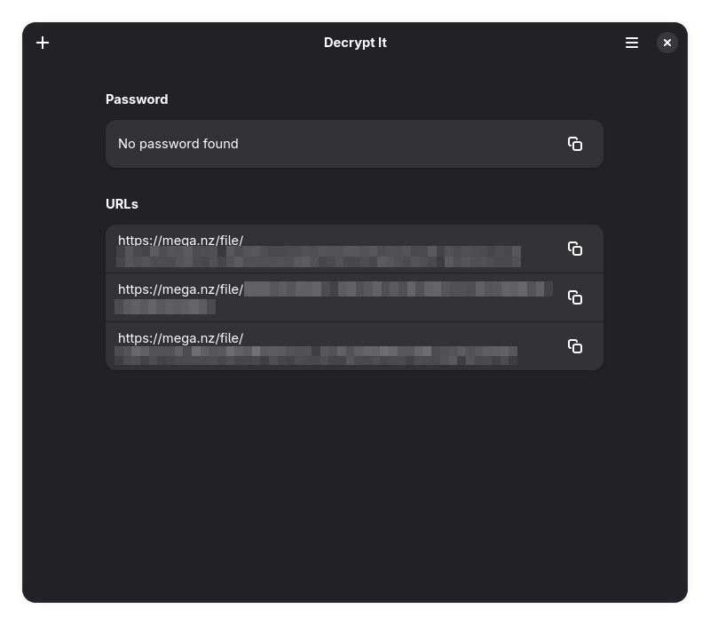

<div align="center">
<h1>Decrypt It</h1>

Decrypt DLC files.


[](https://flathub.org/apps/details/dev.deimoshall.DecryptIt)
[](https://github.com/deimoshall/DecryptIt/-/tags)
[](https://github.com/deimoshall/DecryptIt/-/raw/main/LICENSE)

</div>

## Installation

Coming soon.

<a href='https://flathub.org/apps/details/dev.deimoshall.DecryptIt'></a>

## About

Decrypt It is an alternative to [dcrypt.it](https://dcrypt.it/). Having options is always good, isn't it?

Install the app and use it to decrypt your DLC files.



You can also drag and drop your files into the app!

## Contributing

Issues and merge requests are more than welcome. However, please take the following into consideration:

- This project follows the [GNOME Code of Conduct](https://conduct.gnome.org/)
- Only Flatpak is supported

## Development

### GNOME Builder

The recommended method is to use GNOME Builder:

1. Install [GNOME Builder](https://apps.gnome.org/app/org.gnome.Builder/) from Flathub
2. Open Builder and select "Clone Repository..."
3. Clone `https://github.com/DeimosHall/decrypt-it.git` (or your fork)
4. Press "Run Project" (▶) at the top, or `Ctrl`+`Shift`+`[Spacebar]`.

### Flatpak

You can install Decrypt It from the latest commit:

1. Install [`org.flatpak.Builder`](https://github.com/flathub/org.flatpak.Builder) from Flathub
2. Clone `https://github.com/DeimosHall/decrypt-it.git` (or your fork)
3. Install the app using `flatpak-builder`:

```bash
flatpak-builder --force-clean --user --install builddir dev.deimoshall.DecryptIt.json
```

4. Run the app

```bash
flatpak run dev.deimoshall.DecryptIt
```

### Meson

You can build and install on your host system by directly using the Meson buildsystem:

1. Install `blueprint-compiler`
2. Run the following commands (with `/usr` prefix):

```
meson --prefix=/usr build
ninja -C build
sudo ninja -C build install
```

## License

This project is licensed under the GPLv3 license. See the [License](LICENSE) file for more information.

## Credits

Made with ♥️ by Deimos Hall.

Inspired on the code of [`Switcheroo`](https://gitlab.com/adhami3310/Switcheroo.git) by Khaleel Al-Adhami, an app to convert and manipulate images.

